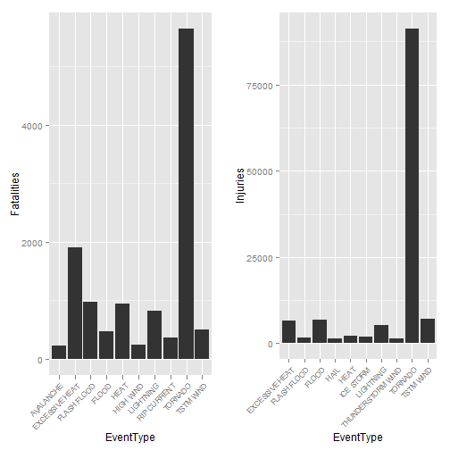

NOAA_Storm_Database_Analysis
============================

## Synopsis
This report analyzes data in the U.S. National Oceanic and Atmospheric Association's storm database for the purpose of answering a number of questions concerning public health and economic consequences of weather activity.

The data to be analyzed has been collected into a comma-seperated-value file which is compressed using the bzip2 algorithm. The report author followed the assignment instructions by downloading the compressed file from https://d396qusza40orc.cloudfront.net/repdata%2Fdata%2FStormData.csv.bz2. 


There are also two reference documents that the author has reviewed:

* [Storm Data Documentation](https://d396qusza40orc.cloudfront.net/repdata%2Fpeer2_doc%2Fpd01016005curr.pdf)

* [National Climatic Data Center Storm Events FAQ](https://d396qusza40orc.cloudfront.net/repdata%2Fpeer2_doc%2FNCDC%20Storm%20Events-FAQ%20Page.pdf)


## Data Processing
This section covers the processing of the data.

#### Steps Taken
1. Set the knitr cache option to TRUE for the entire code block so that the time-consuming download and processing of the data only occurs if there is a change. 

2. Download the compressed data file.
3. Decompress the file, feeding the output to the read.csv function to read the data file into a data.frame.
4. Sum the fatalities by the event type across all regions and store in a new
data frame named 'fatals'.

5. Sort 'fatals' by fatalities in descending order, bringing the most fatal event types to the top.

6. Create a new data.frame named 'mostfatal' containing the top ten rows of the 'fatals' data.frame.

7. Perform steps 3 through 5 again but using the INJURIES column of the original data in place of FATALITIES.

8. Display side-by-side histograms showing the most fatal and the most injurious event types.

#### Data Processing Code

```r
library(downloader)
download(url="https://d396qusza40orc.cloudfront.net/repdata%2Fdata%2FStormData.csv.bz2", destfile="StormData.csv.bz2")

data1 <- read.csv(bzfile("StormData.csv.bz2"))
```


```r
fatals <- aggregate(data1$FATALITIES, by=list(data1$EVTYPE), FUN=sum)
colnames(fatals) <- c("EventType", "Fatalities")
fatals <- fatals[with(fatals, order(-Fatalities)),]
mostfatal <- fatals[1:10,]

injuries <- aggregate(data1$INJURIES, by=list(data1$EVTYPE), FUN=sum)
colnames(injuries) <- c("EventType", "Injuries")
injuries <- injuries[with(injuries, order(-Injuries)),]
mostinjuries <- injuries[1:10,]

library(ggplot2)
library(grid)

# function for displaying any plot in the grid
vplayout <- function(x, y) viewport(layout.pos.row = x, layout.pos.col = y)

plot1 <- ggplot(mostfatal, aes( x = EventType, y = Fatalities)) + geom_histogram(stat= "identity") + theme(axis.text.x = element_text(size=8, angle=45, hjust=1))
plot2 <- ggplot(mostinjuries, aes( x = EventType, y = Injuries)) + geom_histogram(stat= "identity") + theme(axis.text.x = element_text(size=8, angle=45, hjust=1))

grid.newpage()
pushViewport(viewport(layout = grid.layout(1, 2)))
print(plot1, vp = vplayout(1, 1))
print(plot2, vp = vplayout(1, 2))
```

 
